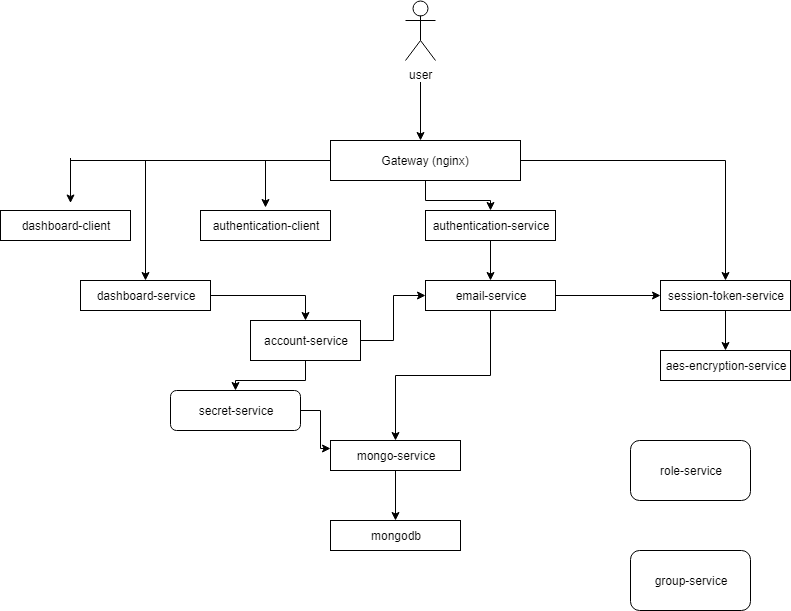

# Devops-mini-project
simple gateway app built using microservices, rebuilt using docker and docker compose
the project architecture can be seen in the diagram below

# project contents
this repository contains the source files as well as docker files for each individual service.
the main directory contains a docker-compose.yaml that has services settup for each individual component, launching from the bottom service up due to dependancies.
enviroment variables are supplied using a within the main direcotry with docker-compose file. .env is not included in the repository and must be supplied

# Rebuilding images and running services
images can be build from the main directory using docker-compose build
and all services can be lauched with docker-compose up

these files are used as the basis of a CI-pipleline of this project and a seperate project utilising kuberentes.

